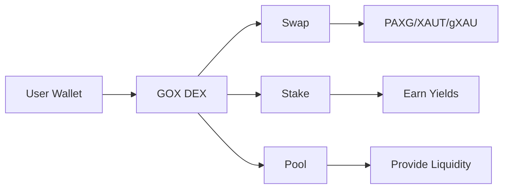

# GOX - Gold Decentralized Exchange

GOX is a pioneering decentralized exchange (DEX) platform specifically designed for gold-backed digital assets and Real World Assets (RWA). We provide a secure, transparent, and efficient marketplace for trading physical gold-backed tokens on the blockchain.

## What is GOX?

GOX enables investors to:
- Trade gold-backed cryptocurrencies (PAXG, XAUT, gXAU)
- Access real-time gold spot prices and market data
- Swap between different gold tokens instantly
- Stake gold tokens to earn yields
- Provide liquidity and earn trading fees

## Key Features

### 🏆 Gold-Backed Tokens
Trade 100% physical gold-backed digital assets including:
- **PAXG** (Pax Gold) - 1 token = 1 troy ounce of gold
- **XAUT** (Tether Gold) - 1 token = 1 troy ounce of gold
- **gXAU** (GOX Gold) - Native gold token

### 📊 Real-Time Market Data
- Live gold spot prices (XAU/USD)
- Historical price charts from 1978 to present
- 24h trading volume and market analytics
- Token comparison and premium tracking

### 🔐 Blockchain Security
- Decentralized and non-custodial
- Smart contract audited
- Transparent on-chain transactions
- Multi-chain support (Ethereum, Arbitrum, Polygon)

### 💎 DeFi Features
- Token swapping with low fees
- Liquidity pools with competitive APY
- Staking programs (30-90 day lock periods)
- Yield farming opportunities

## Quick Start

<Cards>
  <Card title="Getting Started" href="/docs/getting-started" />
  <Card title="Trading Guide" href="/docs/trading" />
  <Card title="Staking & Farming" href="/docs/staking" />
  <Card title="API Reference" href="/docs/api" />
</Cards>

## Platform Overview

## Why Choose GOX?

- **Low Fees**: Competitive trading fees with no hidden costs
- **High Liquidity**: Deep liquidity pools for minimal slippage
- **24/7 Trading**: Trade anytime, anywhere
- **Global Access**: No KYC required for basic trading
- **Audited & Secure**: Smart contracts audited by leading firms
- **Real Gold Backing**: All tokens backed by physical gold in secure vaults
